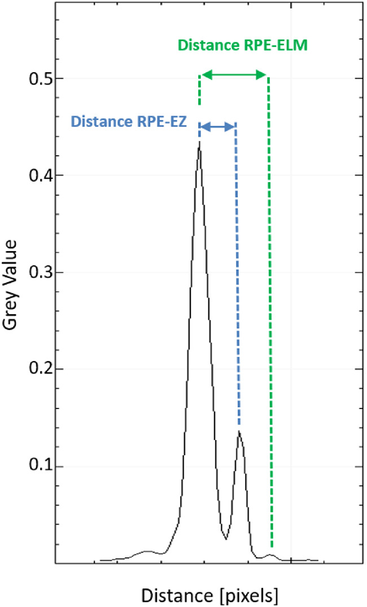

# relEZIquantification
This is the official code of the paper: [Validation of an Automated Quantification of Relative Ellipsoid Zone Reflectivity on Spectral Domain-Optical Coherence Tomography Images] (https://tvst.arvojournals.org/article.aspx?articleid=2770914)

